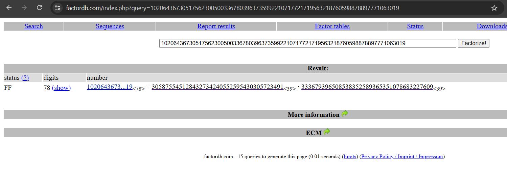

# Prime Suspects

## Description

The suspect encrypted a message using a suspiciously weak RSA setup. Can you uncover what they were trying to hide?

We've recovered the following:

> n = 102064367305175623005003367803963735992210717721719563218760598878897771063019
e = 65537
c = 66538583650087752653364112099322882026083260207958188191147900019851853145222

## Writeup

RSA can be very secure if the right primes are used for the key, but if the public key modulus (`n`) is easily factorable, all that strength turns into weakness.

FactorDB stores a bunch of information on the factors of large numbers, so we can plug our `n` in there!



Well, from here, we can find our factors of `n` are `p = 305875545128432734240552595430305723491` and `q = 333679396508538352589365351078683227609`

And now to solve this is pretty simple!

```python
from Crypto.Util.number import long_to_bytes

# Our given information
n = 102064367305175623005003367803963735992210717721719563218760598878897771063019
e = 65537
c = 66538583650087752653364112099322882026083260207958188191147900019851853145222

# Our factors
p = 305875545128432734240552595430305723491
q = 333679396508538352589365351078683227609

# Calculate Euler's totient
# This is the same phi as in Euler's theorem which is how this works
phi = (p - 1) * (q - 1)

# Calculate modular inverse of our exponent
d = pow(e, -1, phi)

# Get plaintext using RSA
plaintext = pow(c, d, n)

# Print as text
print(long_to_bytes(plaintext))
```

And if we run this, we get our flag, `SVUSCG{sm4ll_pr1m3s}`!
