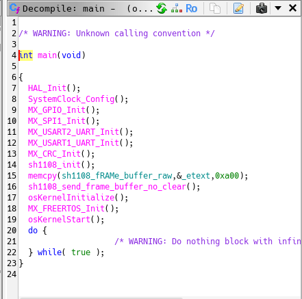
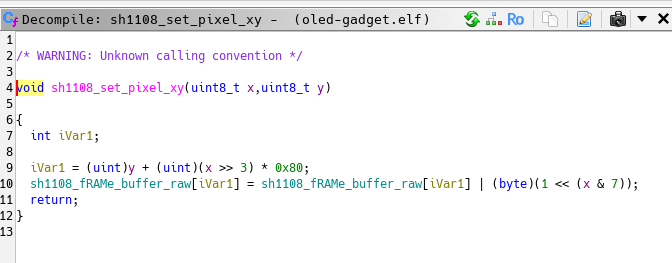
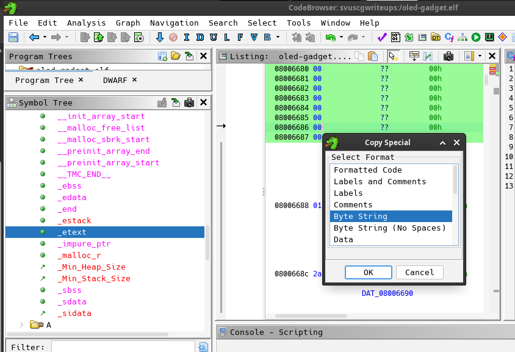
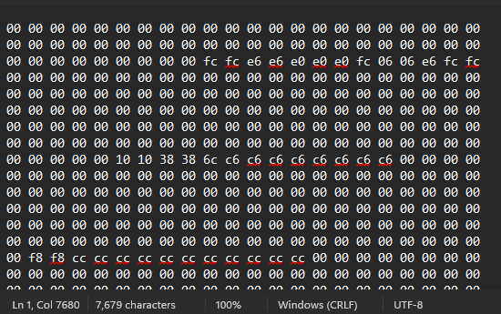
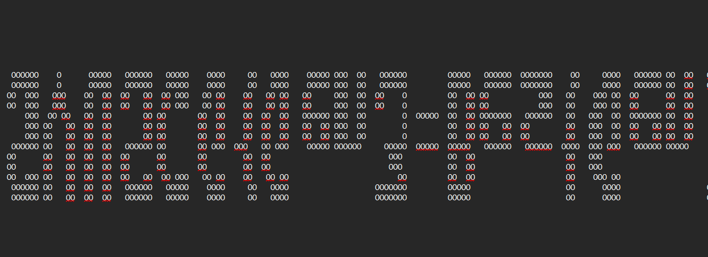
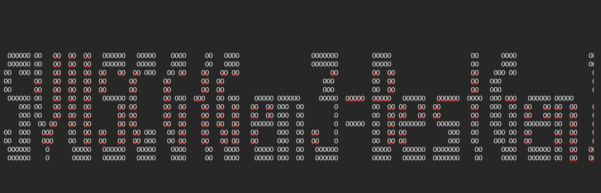

# OLED Gadget Password Recovery

## Description

Help! My husband was in a motorcycle accident. I need to start paying some of his medical bills, but I can't log into anything because I don't know the password to his password manager! He kept it saved as an image that would appear on his little microcontroller gadget with an OLED screen that he takes everywhere with him. The trouble is that the screen to his gadget was broken in the accident and he never told me what the password was. I managed to get the ELF file he used to program his gadget - could you try and find the image? The image would display as soon as he turned it on and he was a big Pokemon nerd, if that helps.

## Files

* [oled-gadget.bin](oled-gadget.bin)

* [oled-gadget.elf](oled-gadget.elf)

* [sh1108v2.0.pdf](sh1108v2.0.pdf)

## Writeup

The first step for this challenge is to open the ELF file in Ghidra and let it analyze the binary. Once we have that, we can go into the `main` function and start seeing what happens. 



That raw frame buffer that is being written seems like it could be helpful! This is likely the image we need to view, stored initially in `_etext` with a total length of `0xa00` or 2560 in decimal.

However, it's also important to know how to map the location in memory to the x and y coordinates of a pixel on the 160x160 display. Luckily for us, there is another function, `sh1108_set_pixel_xy` which is perfect for this!



The `x >> 3` operation is the same as integer division by 8. Similarly, the `x & 7` is the same as `x % 8` (modulus). Since the same memory location is used for 8 consecutive values of x and we see an or operation on the `(x % 8)th` bit, this tells us that the `x` coordinate is set based on bits rather than bytes. However, we can ultimately just reuse this expression later!

Now, we just need to extract the image data and write a script to render it!

There's definitely other ways to extract it, but probably the easiest quick way is to highlight a bunch of data from the `_etext` label and copy the byte string!



And we can copy that into a text file!



Using what we know, we can write this script:

```python
# Our output file
output = open("oled-output.txt", "wt+")
# Open the byte string file
with open("image-hex.txt") as file:
    # Get first line of file
    content = str(file.read()).split("\n")[0]
    # Get individual hexadecimal bytes
    b = content.split(" ")

    # Add null bytes for padding to prevent index out of range errors
    for i in range(100): b.append("00")

    # Loop through 160 y values
    for y in range(160):
        # Stores this row
        temp = ""
        # Loop through 160 x values
        for x in range(160):
            # Get index from x and y
            idx = y + (x // 8) * 0x80
            # Get value from index
            value = int(b[idx], 16) & (1 << (x & 7))
            # Print an O for on and space for off
            if value > 0:
                temp += "O"
            else:
                temp += " "
        # Write the line to our file
        output.write(temp + "\n")
# Close the file
output.close()
```

When we run this and open our file, we get something interesting, but it looks upside down.



We can update our script to reverse the range for y and try again!

```python
# Our output file
output = open("oled-output.txt", "wt+")
# Open the byte string file
with open("image-hex.txt") as file:
    # Get first line of file
    content = str(file.read()).split("\n")[0]
    # Get individual hexadecimal bytes
    b = content.split(" ")

    # Add null bytes for padding to prevent index out of range errors
    for i in range(100): b.append("00")

    # Loop through 160 y values
    for y in reversed(range(160)):
        # Stores this row
        temp = ""
        # Loop through 160 x values
        for x in range(160):
            # Get index from x and y
            idx = y + (x // 8) * 0x80
            # Get value from index
            value = int(b[idx], 16) & (1 << (x & 7))
            # Print an O for on and space for off
            if value > 0:
                temp += "O"
            else:
                temp += " "
        # Write the line to our file
        output.write(temp + "\n")
# Close the file
output.close()
```

And now we can see the flag!



And our flag is `SVUSCG{Gen3=BestGen}`!
